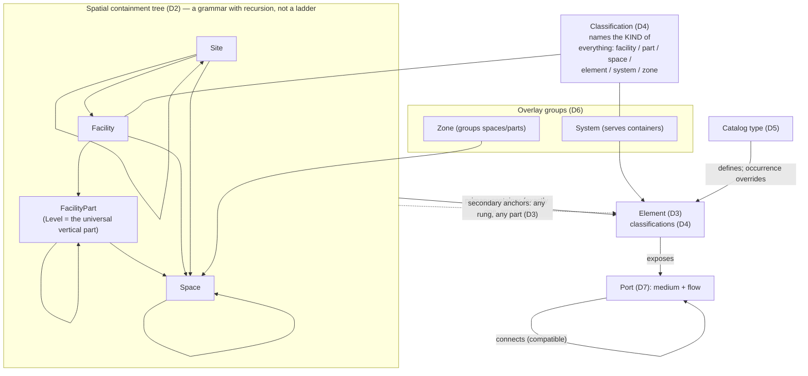

# 2 · Domain model — what is true, in domain language

These statements use **no USD vocabulary**. They are the facts an
implementation can only respect or violate; if one of them is wrong,
everything built on it is wrong regardless of engineering quality. This is
where an architect, an IFC veteran or a facilities manager should aim
their disagreement.

The core commits to twelve truths, all about the **built thing**. The
project *record* — what people say about the built thing — is outside these twelve commitments.

## 2.1 The built thing (D1–D12)

**D1 · Projects develop facilities on sites.** A project scopes identity,
units and collaboration; sites host facilities — buildings, bridges, roads,
plants — each operated as a whole.

**D2 · Spatial containment is a tree; its rungs recur and its shape
follows the facility.** Every project breaks its physical extent into
nested named containers, and every discipline, contract, schedule and
handover assumes that breakdown. The *pattern* is universal: **sites**
(areas of land or water — which nest: campus > parcels); sites host
**facilities** (built assets operated as a unit); facilities subdivide into
**parts** along conventions that differ by kind — wings, blocks, towers and
podiums; road sections and rail segments — and parts subdivide further
(wing > storey; section > segment); the **level** — the horizontal stratum
at a datum elevation — is the one part convention shared by every vertical
facility on earth, and levels themselves subdivide (mezzanines, split
levels); parts, facilities and sites bound **spaces** (rooms, halls,
corridors, atria, yards, plazas), and spaces subdivide (open plan > work
zones). What is *invariant*: containment is a tree (each container one
parent, each element one primary container); recursion at a rung is
normal, not exceptional; depth is not fixed; and the kind vocabulary above
the rungs is sector-shaped and open.

IFC documents this truth as four successive retreats from its own fixed
ladder: per-instance `CompositionType` (COMPLEX/ELEMENT/PARTIAL — "a storey
is split into two or more partial storeys, each with a different
elevation"), `IfcSpatialZone` for cross-cutting extents,
`IfcExternalSpatialElement` (new in IFC4) because plazas had no legal home,
and `IfcFacility` (IFC 4.3) because Building was never the general case.

**D3 · Elements are physical things with stable identity.** Walls, pipes,
racks, luminaires: identity must survive rename, move, re-export and
re-authoring — it is the join key for costing, sequencing, issue tracking
and FM. An element is contained in exactly one container — of *any* rung: a
duct in a space, a wall on a level, a drainage run on a site — and may
physically serve or span others, including containers of other facility
parts or facilities (a riser, a curtain wall, a skybridge between towers).

**D4 · What a thing *is* is owned outside any dataset.** Every question
about kind — the coarse census ("all walls, all cable trays") and the fine
classification ("Ss_25_10_32", "IfcSanitaryTerminal") — is answered by
external, versioned dictionaries (the IFC entity taxonomy itself,
Uniclass, OmniClass, ETIM, bSDD): several per element, evolving faster than
any schema release, and already shared across the industry. A dataset
that invents its own kind vocabulary, however coarse, is a dataset the
next tool cannot join.

**D5 · Elements come as types and occurrences.** A wall build-up or basin
model is defined once (the catalog type, often with manufacturer identity)
and placed many times; type edits reach occurrences; occurrence statements
override type statements.

**D6 · Systems and zones overlay the tree, and they are different
things.** A *system* is a functional service network — cold water, a
circuit — the logical view of a service, distinct from its members. A
*zone* is a purpose grouping — fire compartment, HVAC zone, department —
usually of spaces. Both reference members without containing them;
membership never changes where a thing is; anything may belong to many
groups. Systems additionally *serve* spatial regions, a coarser fact than
connectivity that exists before any pipe is drawn.

The razor between the tree and the overlays is *addressing*: the tree is
how a thing is **addressed** — its one place, owned by no discipline;
remove a container and its contents need a new home. A zone is a **claim**
about things addressed elsewhere — remove it and only the claim
disappears. A fire compartment may coincide with Level 3 on day one; it
still encodes a different fact, is owned by a different discipline, and
diverges at the first atrium or shaft. The same razor settles borderline
vocabulary: a data-hall "row" is a region if racks are addressed by it
(`…/Row07/Rack03`) and a zone if racks keep hall addresses and rows are an
operational overlay — a sector profile fixes one choice per project.

**D7 · Distribution connects at ports, with direction and medium.**
Connectivity is a graph of discrete connection points with position, flow
direction and medium; connected ports must be flow- and medium-compatible.
This graph is the substrate of sizing and commissioning — and, in measured
practice, the least reliably exchanged data in BIM.

**D8 · Elements and containers have lifecycle phase** (proposed, existing,
temporary, demolished), filtered by every discipline's view. A renovation
holds existing fabric and the proposed remodel in one structure.

**D9 · Data arrives federated.** Each discipline authors its own dataset
independently; the model is their overlay; who-said-what is
provenance, not an attribute.

**D10 · Identity extends beyond elements.** Spaces, levels, systems, zones
and ports are addressable in issue tracking, room registries and O&M
documents — everything nameable in a contract needs an identity that
outlives structure.

**D11 · Standardized and ad-hoc data coexist and must not blur.**
Industry-governed properties (fire rating, flow rate) need uniform
definitions; every project also carries ad-hoc data. Both are legitimate;
confusing them is how same-named properties with different meanings
destroyed cross-firm exchange (the shared-parameter lesson).

**D12 · Rules are two-tier.** Some rules are universal ("a level belongs
to a facility", "connected ports carry one medium"); most strictness is
contextual per sector, jurisdiction or exchange. A road must not be an
invalid building.

## 2.2 What the core deliberately does not say

Three families of truth were surveyed with the same care and are **not**
in the core, because they are truths about something other than the built
thing:

- **The project record** (documents, parties, issues, changes, programme,
  cost, responsibility, status): everything a project *says about* the
  built thing. Its defining truth — every register is the same row, and
  every row points at spatial scope — is exactly why it must sit *on top
  of* the core rather than inside it.
- **What a kind of element knows** (a wall's build-up, a pipe's nominal
  diameter, a tray's fill): true, standardized, and specific to a kind —
  which makes it an applied schema from an element-kind library, never a
  core property.
- **Datums** (grids, alignments, benchmarks): the third referent kind —
  what the built world is *measured against*. A stress test found the
  referent inventory one family short; the family is carried as a
  separate library pending evidence for promotion.
