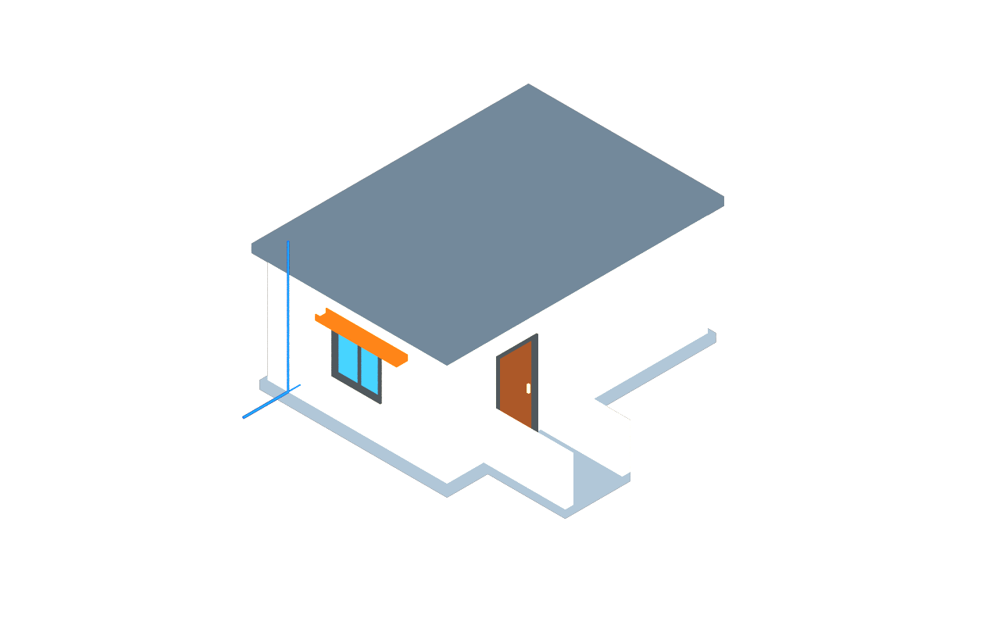

# usdAeco

Identity, five spatial types, groups, ports, classification, catalog inheritance
and one representation mark. Core adds no geometry schema and requires no drivers.

Start with the [minimal example](../examples/minimal.usda). The
[small building](../examples/small_building.usda) shows 16 elements, two
levels, shared catalog values, a port network and plain marked guide curves.
Enable guide, proxy and render purposes to see all representations.

The [schema reference](../../docs/04-schema-reference.md) lists every property.
The [worked examples](../../docs/07-worked-examples.md) compose classified
elements and ports with separate derived representation layers.
